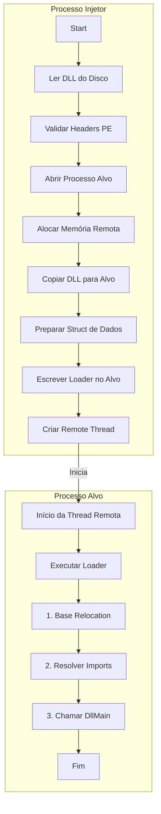

# Manual DLL Injection em C++

Este projeto é uma implementação funcional em C++ de um injetor de DLL que utiliza a técnica de **mapeamento manual** (*Manual Mapping*). O código foi desenvolvido para carregar uma DLL (Dynamic-Link Library) no espaço de memória de um processo alvo sem usar a função padrão `LoadLibrary` da API do Windows.

A implementação demonstra as etapas essenciais do processo, incluindo a leitura do arquivo da DLL, alocação de memória, correção de endereços e a execução do seu ponto de entrada (`DllMain`) através de uma *thread* remota.

<div align="center">


</div>

---

## Funcionalidades Implementadas

Este código executa as seguintes operações, exatamente nesta ordem:

-   **Ajuste de Privilégios**: Tenta obter o `SE_PRIVILEGE_ENABLED` para o processo atual.
-   **Leitura de Arquivo**: Abre e lê o arquivo da DLL do disco para um *buffer* na memória.
-   **Validação de PE**: Verifica a assinatura do arquivo para garantir que é uma imagem PE e uma DLL.
-   **Alocação de Memória Remota**: Aloca memória no processo alvo usando `VirtualAllocEx`.
-   **Mapeamento de Seções**: Copia os *headers* e as seções da DLL para a memória do processo alvo.
-   **Base Relocation**: Corrige os endereços de memória da DLL com base na diferença (`delta`) entre o `ImageBase` real e o preferencial.
-   **Resolução de Imports**: Resolve as dependências da DLL usando `LoadLibraryA` e `GetProcAddress`.
-   **Execução via Remote Thread**: Cria uma *thread* no processo alvo (`CreateRemoteThread`) para executar o *loader* da DLL.

## Diagrama do Processo de Injeção

O diagrama abaixo ilustra o fluxo de operações realizadas pelo injetor:



## Como Usar

Compile o código em um ambiente Windows com um compilador C++ (como Visual Studio ou MinGW-w64). Execute o programa com privilégios de administrador.

**Comando:**
```bash
ManualInject.exe <caminho_da_dll> <PID_do_processo>
```

**Exemplo:**
```bash
# Injeta mydll.dll no processo com PID 1234
ManualInject.exe mydll.dll 1234
```

## Estrutura de Dados Principal

A *struct* `MANUAL_INJECT` é usada para passar toda a informação necessária do injetor para o código que será executado remotamente.

```cpp
typedef struct _MANUAL_INJECT
{
    PVOID ImageBase;                    // Endereço base da DLL no processo alvo
    PIMAGE_NT_HEADERS NtHeaders;        // Cabeçalho NT da DLL
    PIMAGE_BASE_RELOCATION BaseRelocation; // Informação para realocar endereços
    PIMAGE_IMPORT_DESCRIPTOR ImportDirectory; // Diretório de imports da DLL
    pLoadLibraryA fnLoadLibraryA;       // Ponteiro para LoadLibraryA
    pGetProcAddress fnGetProcAddress;   // Ponteiro para GetProcAddress
} MANUAL_INJECT, *PMANUAL_INJECT;
```

---

### Contribua com o Projeto!

**Gostou deste projeto?** Ele foi criado para fins de estudo e para demonstrar habilidades em programação de baixo nível. Se você o achou útil ou interessante, por favor, considere dar uma **estrela (⭐)** neste repositório!

O seu apoio ajuda a motivar e a dar mais visibilidade ao meu trabalho.

---

## Disclaimer

Este código foi desenvolvido para fins educacionais e de pesquisa. O objetivo é entender como o carregamento de DLLs e a manipulação de memória funcionam no Windows. Use-o de forma responsável.
